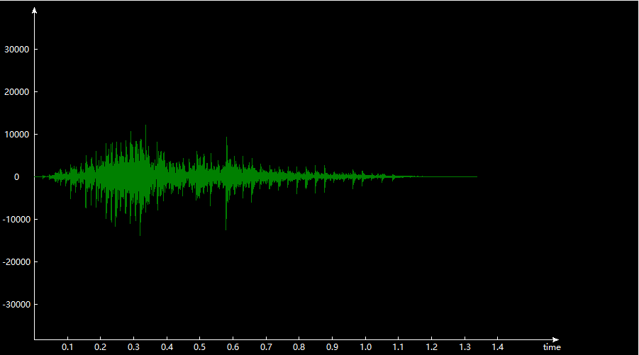
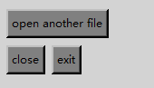
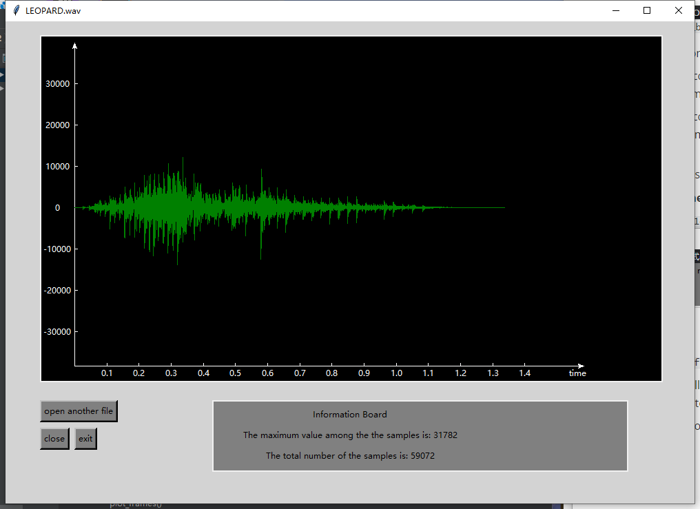

# Q2 Report

The GUI part is implement using python `tkinter`

### File input

* The function `read_wav()` is for file input, which returns a "wav file path".

  ```python
  wav_path = filedialog.askopenfilename(initialdir=os.getcwd(),
                             title="Please select a wav file:")
  if wav_path == '':
      exit()
  ```

  * I use the `filedialog` in tkinter library to ask user to choose an input file.
  * If user open the dialog box but did not choose any file, the program finish

### File processing

The function `wav_to_binary()` convert a wav file to binary file, and returns the binary in an array.

* Firstly, the function read the input file and divide it into two parts

  * `header` contains the first 44 bytes in the file, which is the **header of wav file**. It stores the detailed information about the file, such as the file size, audio format, and sample rate, etc.
  * `data` contains the rest of the file, which is the **actual sound data**.

* Then calculate the **number of frames** in the sound file, the calculation method for each type of wav file is:

  ```python
      if header[34] == 16:
          nframes = (int)((wav_length - 44) / 2)
      elif header[34] == 8:
          nframes = wav_length-44
      elif header[34] == 24:
          nframes = (int)((wav_length-44) / 3)
      else:
          print("Sorry, we don't support this file")
          exit()
  ```

  * `header[34]` indicates the **bits per sample**.

* Next, I put the data in `data` array into array `frames`.

  * Since python does not convert the binary to signed integer automatically, I convert it by the formula:

    ```python
    frames[j] = frame[j] - 2^(n-1)
    ```

    where $n$ is the number of bits per sample.

### fade in fade out

I use a linear fade in fade out method. Since the vertical axies indicate the voltage of the sound, the faded sound is calculate by multiply a factor with the original data. 

* for the first half of the samples, it is faded in, every frame multiple $i/middle$ with $i$ increase in a linear speed:

  ```python
      for i in range(middle):
          faded_frames[i] = frames[i]*i/middle
  ```

* for the second half of samples, it is faded out, every frames multiple $(len(frames)-i)/middle$ with $i$ increase in a linear speed:

  ```python
      for i in range(middle, len(frames)):
          faded_frames[i] = frames[i]*(len(frames)-i)/middle
  ```

### Display the output waveform

The function `plot_frames()` use a tkinter widget `Canvas` to show the sound wave.

* First draw the axies:

  * x-axies with scale on it, the scale is depend on the length of the sound file.

    ```python
    canvas.create_line(50,480, 790,480, fill="white", arrow=LAST) # x
    x_range = int(time * 10 + 2)
    for i in range(1,x_range):
    	x = i*700/x_range
        canvas.create_line(x+x0, 480, x+x0, 475, fill="white")
        canvas.create_text(x+x0, 490, fill="white", text=str(round(0.1*i,1)))
    canvas.create_text(780, 490, fill="white", text="time")
    ```

* Then draw the y-axies:

  * y-axis with scale on it, the scale is depend on the maximum value in the samples. Different sample rates use different scale.

    ```python
    canvas.create_line(50,480, 50,10, fill="white", arrow=LAST) # y
    for i in range(start, end, step):
        y = (i/step) * 60
        canvas.create_line(x0, y+y0, x0+5, y+y0, fill="white")
        canvas.create_text(x0-25, y+y0, fill="white", text=str(-i))
    ```

    where `start`, `end`, `step` are different in different sample size.

* Calculate the frame's position for each frame and draw it on `canvas`

  * calculate x:

    ```python
     x = x0 + 10 * 700/x_range * (t * sample_time)
    ```

  * calculate y:

    ```python
    y = (y0-faded_frames[t]/step*60)
    ```

* Sample screenshot

  

### Display information

`info_frame` is an area to show the information required.


### Buttons

* `open another file ` button allows user to open another file and processing it.

* `close` button allows user to close the GUI window. Be caution that it only destroy the GUI window, but not terminate the program.

* `exit` button allows user to terminate the program.

  


The whole window display:

